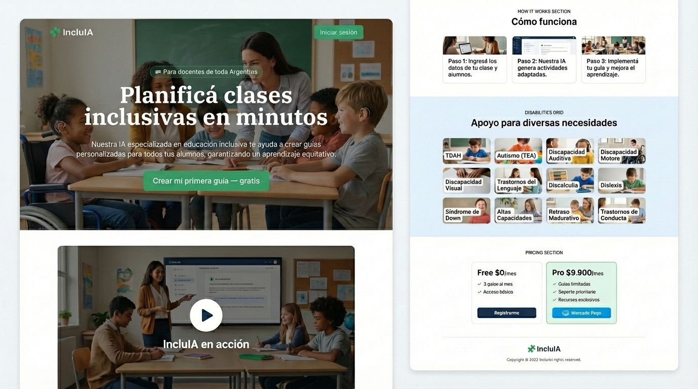
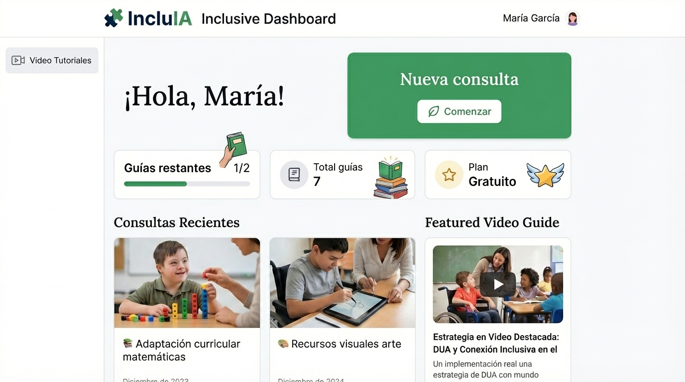
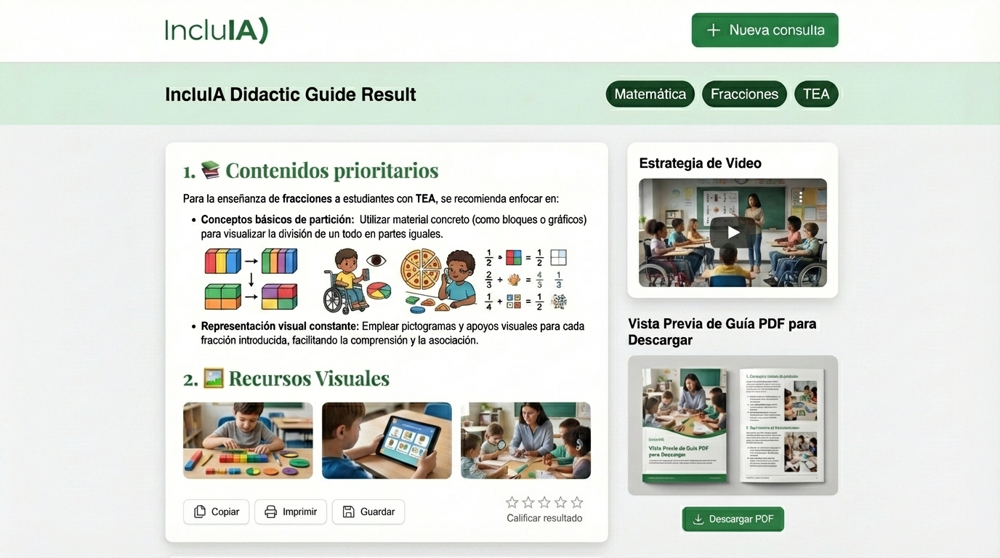
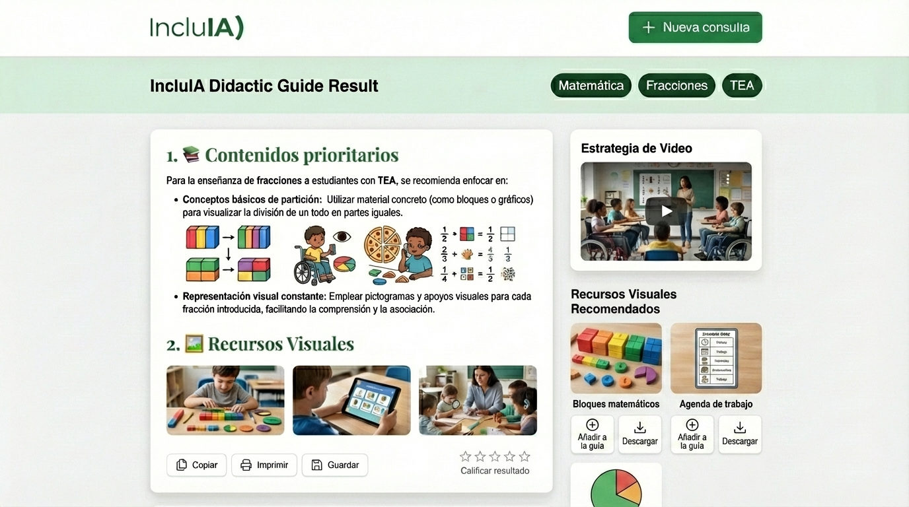
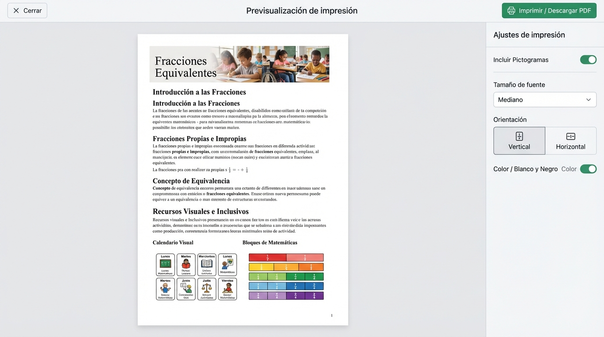
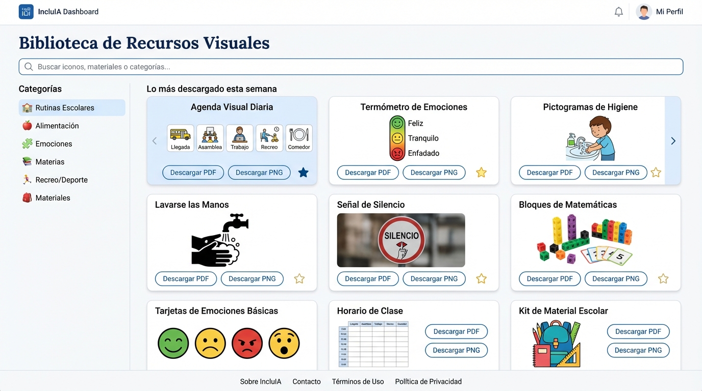
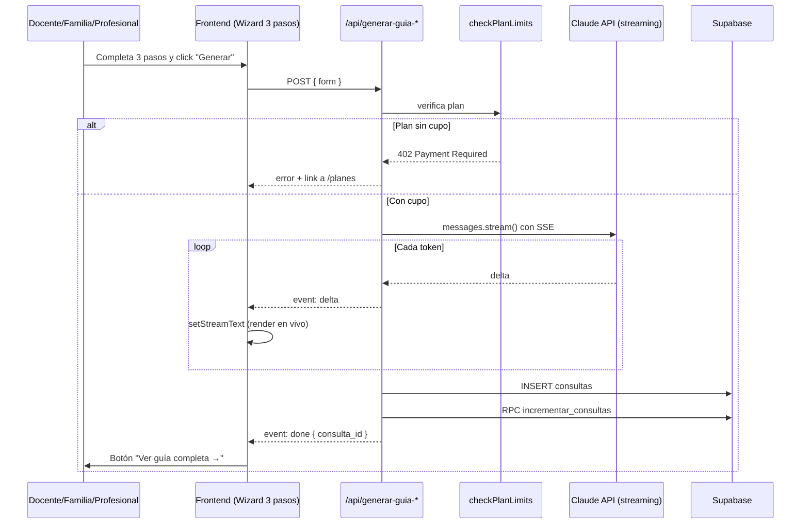
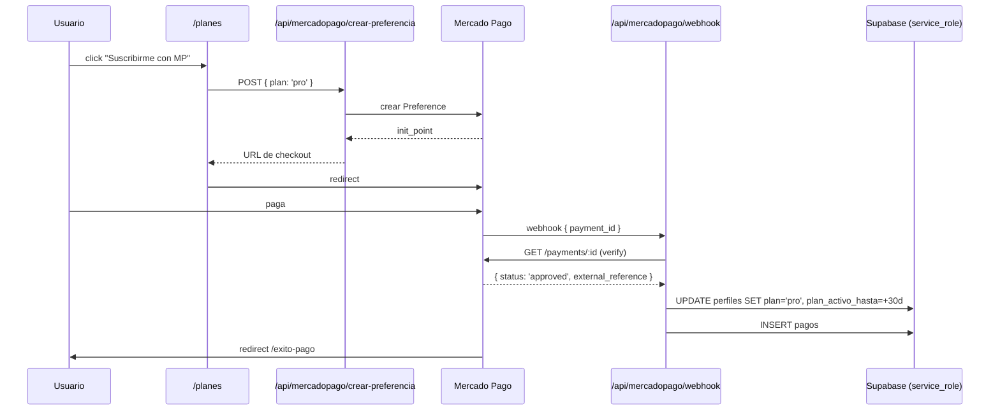

<div align="center">

# 🧩 IncluAI

### **Planificá clases inclusivas en minutos**

Plataforma SaaS de **educación inclusiva con IA** para **docentes, familias y profesionales de salud** en Argentina.
Guías pedagógicas y clínicas concretas, personalizadas para cada alumno/paciente, cada discapacidad y cada contenido.

[](https://nextjs.org)
[](https://react.dev)
[](https://www.typescriptlang.org)
[](https://tailwindcss.com)
[](https://www.prisma.io)
[](https://supabase.com)
[](https://www.anthropic.com)
[](https://www.mercadopago.com.ar)
[](#)

</div>

---

## ✨ Qué hace

IncluAI genera **guías pedagógicas inclusivas en vivo** usando la API de Claude (Anthropic) con **streaming SSE**. Un docente, una familia o un/a profesional completa un formulario de 3 pasos y recibe en segundos una guía con estrategias concretas, materiales adaptados, protocolos de atención y coordinación interdisciplinaria — todo ajustado al marco legal argentino (Ley 26.206, Ley 24.901, Resolución CFE 311/16).

### 3 módulos, una plataforma

| Módulo | Público | Pregunta clave |
|---|---|---|
| 📚 **Docentes** | Maestros y profesores de todo el sistema educativo argentino | *¿Qué contenido vas a enseñar y a quién?* |
| 🏠 **Familias** | Padres, madres, tutores | *¿En qué necesitás ayuda con tu hijo/a en casa?* |
| ⚕️ **Profesionales** | Psicólogos, fonoaudiólogos, TO, kinesiólogos, médicos, odontólogos, etc. | *¿Qué paciente vas a atender y cómo?* |

Los 3 módulos comparten autenticación, planes, pagos, catálogo de discapacidades y motor de IA. Cada uno tiene su propio *system prompt*, builder de prompt y pantallas de formulario y resultado.

---

## 🎨 Screenshots

<div align="center">

### Landing + Hero


### Dashboard del docente


### Guía generada por Claude (streaming)


### Secciones de la guía


### Vista de impresión


### Biblioteca de recursos


<sub>Mockups generados en <a href="https://stitch.withgoogle.com">Google Stitch</a>. La app en producción respeta 1:1 este design system.</sub>

</div>

---

## 🧠 Stack

<div align="center">

| Capa | Tecnología |
|---|---|
| **Framework** | Next.js 16 (App Router + Turbopack) |
| **Runtime** | React 19 + TypeScript 5 |
| **Styling** | Tailwind CSS v4 + shadcn-style UI custom |
| **Tipografías** | Fraunces (serif) + DM Sans (sans) |
| **ORM** | Prisma 7 con `@prisma/adapter-pg` |
| **Database + Auth** | Supabase (Postgres + RLS + triggers) |
| **IA** | Anthropic SDK · modelo `claude-sonnet-4-6` con streaming SSE |
| **Pagos** | Mercado Pago Argentina (Checkout Pro) |
| **Email** | Resend (post-registro via `after()` de Next) |
| **Deploy** | Vercel |

</div>

### Paleta de diseño

```css
--primary:       #1e3a5f   /* Dark institutional blue */
--accent:        #16a34a   /* Green — inclusion */
--cta:           #ea580c   /* Orange CTA */
--primary-bg:    #e8f0fe
--accent-light:  #dcfce7
--background:    #f5f7fa
```

---

## 🏗️ Arquitectura

```
app/
├── (auth)/              → login · registro · verificar-email
├── (dashboard)/         → inicio · nueva-consulta · resultado · historial · perfil · planes
│   ├── familias/        → wizard del módulo familias
│   └── profesionales/   → wizard del módulo profesionales
├── api/
│   ├── generar-guia/             → POST SSE (docentes)
│   ├── generar-guia-familia/     → POST SSE (familias)
│   ├── generar-guia-profesional/ → POST SSE (profesionales)
│   ├── guardar-consulta/
│   ├── feedback/
│   ├── check-plan/
│   └── mercadopago/
│       ├── crear-preferencia/    → POST checkout
│       └── webhook/              → POST/GET público (excluido de proxy)
├── auth/callback/       → OAuth / magic link
├── exito-pago/          → celebración post-pago
└── page.tsx             → landing pública

components/
├── ui/                  → button · input · label · card · select · alert
└── dashboard/           → navbar · consulta-wizard · familia-wizard · profesional-wizard
                          guide-view · feedback-stars · module-selector · upgrade-button · sse

data/                    → discapacidades · niveles · materias · provincias ·
                          areas-familia · especialidades · objetivos-profesional · rangos-edad
lib/
├── supabase/            → client · server · middleware · admin (service role)
├── anthropic.ts         → SDK + modelo
├── auth.ts              → getPerfil / getCurrentUser (React.cache)
├── plan.ts              → checkPlanLimits / incrementarConsultas
├── mercadopago.ts       → SDK + helpers external_reference
├── email.ts             → Resend + template bienvenida
├── prompts.ts           → SYSTEM_PROMPT × 3 + builders
├── generar-guia-stream  → helper SSE compartido entre los 3 módulos
├── validators.ts        → Zod schemas
└── types.ts             → tipos maestros

prisma/                  → schema.prisma + prisma.config.ts
supabase/                → schema.sql + migrations/001-expansion-modulos.sql
proxy.ts                 → auth + redirects (Next 16)
```

---

## 💰 Planes

| Plan | Precio | Guías / mes | Features |
|---|---|---|---|
| 🆓 **Gratuito** | $0 | 2 | Todos los niveles y discapacidades · copiar texto |
| ⚡ **Profesional** | $9.900 / mes | 40 | + Historial · favoritos · exportar PDF · soporte prioritario |

*Las guías se comparten entre los 3 módulos: un plan Pro cubre docente + familia + profesional.*

---

## 🚀 Setup local

### 1. Clonar e instalar
```bash
git clone https://github.com/jfrancesia-hue/IncluAI-nuevo.git
cd IncluAI-nuevo
npm install
```

### 2. Crear proyecto Supabase
1. Entrá a [supabase.com](https://supabase.com) → nuevo proyecto.
2. SQL Editor → ejecutar `supabase/schema.sql`.
3. SQL Editor → ejecutar `supabase/migrations/001-expansion-modulos.sql`.

### 3. Variables de entorno
Copiar `.env.local.example` a `.env.local` y completar:

| Variable | Dónde |
|---|---|
| `NEXT_PUBLIC_SUPABASE_URL` | Supabase → Project Settings → API |
| `NEXT_PUBLIC_SUPABASE_ANON_KEY` | Supabase → Project Settings → API |
| `SUPABASE_SERVICE_ROLE_KEY` | ⚠️ server-only |
| `DATABASE_URL` | Supabase → Database → Connection pooler |
| `ANTHROPIC_API_KEY` | [console.anthropic.com](https://console.anthropic.com) |
| `MP_ACCESS_TOKEN` | [mercadopago.com.ar/developers](https://www.mercadopago.com.ar/developers) |
| `RESEND_API_KEY` | [resend.com](https://resend.com) (opcional en dev) |
| `NEXT_PUBLIC_APP_URL` | `http://localhost:3000` en dev |

### 4. Correr
```bash
npm run db:generate   # prisma generate
npm run dev           # dev server en http://localhost:3000
```

---

## ⚙️ Comandos

```bash
npm run dev           # Next dev (Turbopack)
npm run build         # Build producción
npm run start         # Prod server local
npm run lint          # ESLint
npm run db:generate   # prisma generate
npm run db:push       # push schema.prisma a la DB (sin migrations)
npm run db:migrate    # crear nueva migración
```

---

## 🛡️ Principios

- ✅ **WCAG AA** obligatorio — la app es de educación inclusiva.
- ✅ **Mobile-first** en todas las pantallas.
- ✅ **Español rioplatense argentino** en toda la UI.
- ✅ **Streaming obligatorio** para la respuesta de Claude (UX óptima).
- ✅ **RLS estricto** en todas las tablas de Supabase.
- ✅ **Service role solo en webhooks** (nunca en RSC ni cliente).
- ✅ **Sin `any` en TypeScript**.
- ✅ **Datos maestros textuales** — niveles, materias, discapacidades del prompt-maestro, nunca inventados.

---

## 📂 Flujos principales

<details>
<summary><b>Generar una guía (core del producto)</b></summary>



</details>

<details>
<summary><b>Pago con Mercado Pago</b></summary>



</details>

---

## 🗺️ Roadmap

- [x] Fase 1 — Setup Next.js 16 + Prisma 7 + Tailwind v4
- [x] Fase 2 — Autenticación Supabase + magic link
- [x] Fase 3 — Wizard 3 pasos + streaming Claude
- [x] Fase 4 — Mercado Pago (Checkout Pro + webhook)
- [x] Fase 5 — Landing pública
- [x] Fase 6 — Historial + perfil editable
- [x] Fase 7 — Pulido (proxy, error boundaries, Resend, README, vercel.json)
- [x] Expansión — Módulos Familias + Profesionales
- [ ] Deploy a producción
- [ ] Export PDF de guías (Pro)
- [ ] Suscripciones automáticas de MP
- [ ] Panel admin con métricas

---

## 📄 Licencia

Privado.

---

<div align="center">

**IncluAI** — Hecho en Argentina 🇦🇷 con 💛

</div>
